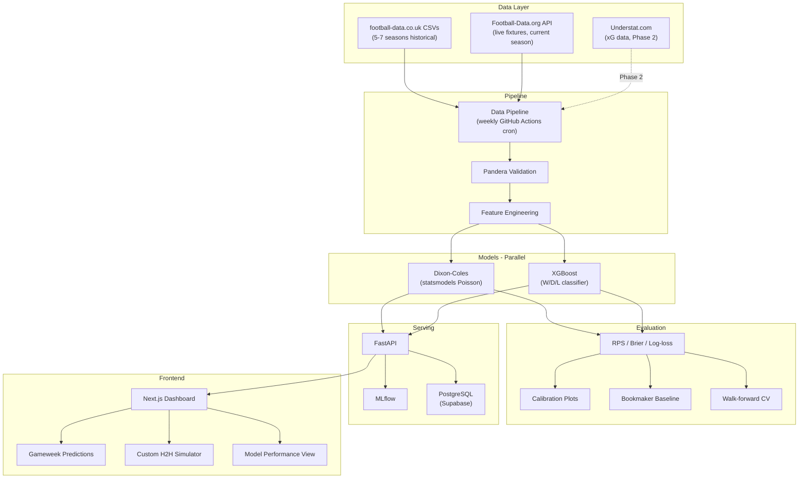

# MatchSense — Design Document

> Premier League match predictor using Dixon-Coles + XGBoost as parallel competing models.
> Designed as a portfolio project demonstrating statistical modeling, ML engineering, and production deployment.

## Architecture Overview



---

## Settled Decisions

### Core

| Decision | Choice | Rationale |
|---|---|---|
| Sport | Soccer | Largest global audience, richest data ecosystem |
| League | Premier League (single, architected for expansion) | Most recognizable, best data availability |
| Prediction targets | Match outcome (W/D/L) probabilities + score distribution | Dixon-Coles naturally produces both |
| Project name | **MatchSense** | — |
| License | MIT, public from day one | Commit history shows iterative progress |

### Modeling Approach

| Decision | Choice | Rationale |
|---|---|---|
| Primary model | **Dixon-Coles** (statsmodels Poisson) | Gold-standard in football analytics, produces score distributions |
| Secondary model | **XGBoost** (W/D/L classifier) | Modern ML comparison, different modeling paradigm |
| Relationship | **Parallel competing models** | Clean RPS comparison, strong portfolio narrative |
| Ensemble | Stretch goal (Phase 2+) | Blend probabilities from both models |
| Key metric | **Ranked Probability Score (RPS)** | Correct ordinal metric for W/D/L; almost nobody uses it — differentiator |

> **Portfolio narrative**: *"I compared a statistically-principled generative model (Dixon-Coles) against a modern ML discriminative model (XGBoost) and rigorously benchmarked both against bookmaker baselines."*

### Tech Stack

| Layer | Choice | Rationale |
|---|---|---|
| ML | XGBoost + statsmodels | Proven, interpretable, production-grade |
| API | FastAPI | Modern async Python, auto-generated docs |
| Database | PostgreSQL (Supabase in prod) | Structured match data, free tier hosting |
| Frontend | Next.js (lightweight dashboard) | SSR, Vercel deployment, React ecosystem |
| Package manager | **uv** | Modern standard, fast, handles venvs + lockfiles |
| Experiment tracking | MLflow (self-hosted) | Industry standard, shows MLOps maturity |
| Containerization | Docker Compose (local dev) | Reproducible local setup |
| CI | GitHub Actions | Tests on every push |

### Data Sources

| Source | What it provides | Phase | Notes |
|---|---|---|---|
| **football-data.co.uk** CSVs | Historical match results + bookmaker odds (5-7 seasons) | Phase 1 | Clean, reliable, no scraping needed |
| **Football-Data.org** API | Live fixtures + current-season results | Phase 3 | Free tier covers PL (10 req/min). **Current-season only** — cannot backfill historical seasons |
| **Understat.com** | xG data (2014/15 onward) | Phase 2 | De facto community standard for PL xG |

> [!IMPORTANT]
> **Dropped**: Squad market value (Transfermarkt scraping risk, weak signal). Replaced by squad depth proxy from lineup rotation patterns.
>
> **Dropped**: FBref/StatsBomb as xG source (StatsBomb open data doesn't comprehensively cover recent PL seasons).

### Features

#### Phase 1 — Core Features
- Home/away indicator
- Historical win rates (overall, home, away)
- League position at time of match
- Recent form (last 5 matches — points, goals scored, goals conceded)
- Head-to-head record (last N meetings)
- Goals scored/conceded rolling averages
- Days since last match (fatigue proxy)

#### Phase 2 — Advanced Features
- **Custom Elo ratings** (with time-decay weighting)
- **Rolling xG** (from Understat data)
- Manager tenure (months in charge)
- **Squad depth proxy** (minutes distribution, rotation patterns from lineup data)

### Evaluation Strategy (Rigorous)

| Component | Details |
|---|---|
| **Primary metric** | Ranked Probability Score (RPS) |
| Secondary metrics | Log-loss, Brier score, accuracy |
| Naive baselines | "Always predict home win", "predict by league standings" |
| **Strong baseline** | Bookmaker implied probabilities (from football-data.co.uk odds) |
| Cross-validation | **Walk-forward** (time-series), per-season breakdown |
| Statistical significance | McNemar's test |
| Calibration | Calibration plots (reliability diagrams) |
| Financial | ROI simulation against bookmaker odds |

### Testing Strategy (Comprehensive)

| Layer | What |
|---|---|
| Unit tests | Feature engineering functions, model prediction outputs, API endpoint responses |
| Integration tests | Data pipeline end-to-end (CSV → DB → features → prediction) |
| Property-based tests | Poisson simulation (probabilities sum to 1, non-negative, score distributions valid) |
| Data validation | **Pandera** schemas on all dataframes |
| CI pipeline | All tests run on every push via GitHub Actions |

### Frontend Dashboard

| Panel | Description |
|---|---|
| Gameweek predictions | Upcoming PL fixtures with predicted outcomes + scores from both models |
| Custom H2H simulator | Pick any two PL teams → get match simulation with probabilities |
| Model performance | Accuracy over time, calibration chart, Dixon-Coles vs XGBoost vs bookmakers |

### Deployment

| Component | Platform | Cost |
|---|---|---|
| API (FastAPI) | Render or Railway | Free tier |
| Frontend (Next.js) | Vercel | Free tier |
| Database (PostgreSQL) | Supabase | Free tier |
| Local dev | Docker Compose | — |

### Repo Structure (Monorepo)

```
matchsense/
├── backend/              # FastAPI application
│   ├── api/              # Route handlers
│   ├── core/             # Config, dependencies
│   ├── models/           # DB models (SQLAlchemy)
│   └── services/         # Business logic
├── ml/                   # ML pipeline
│   ├── data/             # Data loaders, scrapers
│   ├── features/         # Feature engineering
│   ├── models/           # Dixon-Coles, XGBoost
│   ├── evaluation/       # RPS, calibration, backtesting
│   └── experiments/      # MLflow experiment configs
├── frontend/             # Next.js dashboard
│   ├── components/
│   ├── pages/
│   └── public/
├── data/                 # Raw + processed data (gitignored)
├── tests/                # Mirrors src structure
│   ├── unit/
│   ├── integration/
│   └── property/
├── .github/workflows/    # CI + weekly cron
├── docker-compose.yml
├── pyproject.toml        # uv project config
└── README.md
```

### Documentation

| Deliverable | Purpose |
|---|---|
| README.md | Architecture diagram, setup instructions, **demo GIF** |
| Technical blog post | Modeling decisions, Dixon-Coles explanation, evaluation methodology |
| Conventional commits | Clean, readable git history |

---

## Phased Timeline (~7 weeks)

### Phase 1 — Core Predictor (Weeks 1-3)
**Milestone: A working, demoable match predictor**

- [ ] Data pipeline: ingest football-data.co.uk CSVs into PostgreSQL
- [ ] Feature engineering: core features (form, H2H, home/away, fatigue)
- [ ] Dixon-Coles model: implement, train, generate score distributions
- [ ] FastAPI: prediction endpoints (upcoming gameweek + custom H2H)
- [ ] Basic tests + Pandera validation
- [ ] Docker Compose for local dev
- [ ] Basic README

### Phase 2 — ML Rigor (Weeks 4-5)
**Milestone: Rigorous evaluation + advanced modeling**

- [ ] XGBoost model: train W/D/L classifier on same feature set
- [ ] Advanced features: Elo ratings, rolling xG (Understat), squad depth proxy
- [ ] Evaluation suite: RPS, calibration, walk-forward CV, McNemar's, bookmaker baseline
- [ ] ROI simulation against bookmaker odds
- [ ] MLflow integration: experiment tracking, model versioning
- [ ] Comprehensive tests: property-based (Poisson), full CI pipeline

### Phase 3 — Frontend + Polish (Weeks 6-7)
**Milestone: Portfolio-ready with live demo**

- [ ] Next.js dashboard: gameweek view, H2H simulator, performance dashboard
- [ ] Live pipeline: Football-Data.org API integration + GitHub Actions weekly cron
- [ ] Deploy: Render/Railway + Vercel + Supabase
- [ ] Blog post: modeling decisions + evaluation methodology
- [ ] Demo GIF in README
- [ ] Final polish + documentation

---

## Key Risks & Mitigations

| Risk | Mitigation |
|---|---|
| Understat scraping breaks | Defer to Phase 2; core model works without xG |
| Football-Data.org free tier limits change | CSV-based pipeline is self-sufficient for historical data |
| Dixon-Coles implementation complexity | Well-documented in academic literature; reference implementations exist |
| Scope creep from "stretch goals" | Each phase has a hard boundary; stretch goals are explicitly deferred |
